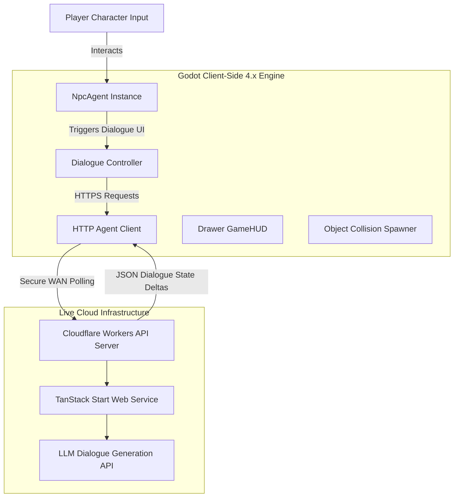
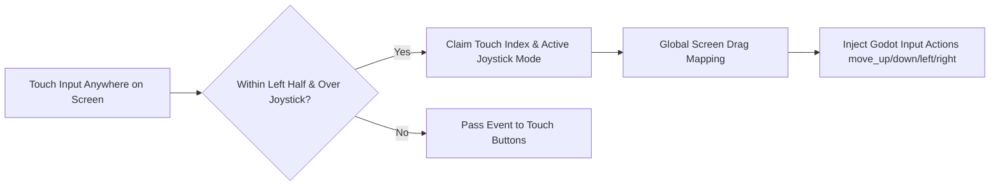
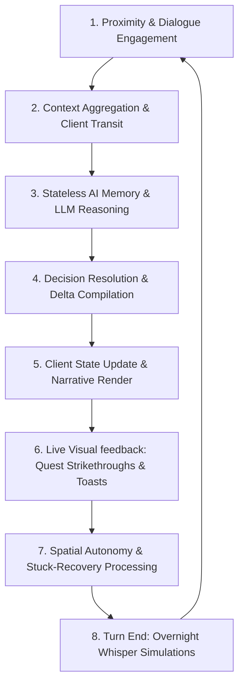

# 🏰 Court of Whispers — System Architecture & Engineering Specification

An immersive, medieval political espionage RPG built on **Godot 4.x (Client)** and powered by a stateless, **LLM-driven Agentic Dialogue Server (TanStack Start & Cloudflare Workers)**.

This specification details the high-level architecture, primary architectural pillars, crucial low-level system designs, asset structures, and our structured, end-to-end **Agentic Workflow**.

---

## 📖 Table of Contents
1. [🎮 Game Overview & System Design](#-game-overview--system-design)
2. [🎨 Production Asset Architecture](#-production-asset-architecture)
3. [🏛️ High-Level System Architecture](#%EF%B8%8F-high-level-system-architecture)
4. [🗺️ Directory Structure & Script Module Map](#%EF%B8%8F-directory-structure--script-module-map)
5. [⚡ Core Architectural Pillars](#-core-architectural-pillars)
   - [A. Stateless Client-Server State Synchronization](#a-stateless-client-server-state-synchronization)
   - [B. Intelligent NPC Agents & Physical Boundaries](#b-intelligent-npc-agents--physical-boundaries)
   - [C. Dynamic Audio Transitions & Audio Resiliency](#c-dynamic-audio-transitions--audio-resiliency)
   - [D. Mobile APK Input & Orientation Engine](#d-mobile-apk-input--orientation-engine)
6. [🧠 The End-to-End Agentic Workflow](#-the-end-to-end-agentic-workflow)
7. [📦 Platform Deployment & Build Pipeline](#-platform-deployment--build-pipeline)

---

## 🎮 Game Overview & System Design

**Court of Whispers** is a tactical narrative game where players assume the role of an elite whispers agent infiltrating a medieval town. The objective is to manipulate local authorities, gather critical intelligence, and organize a coup within a rigid, 5-day cycle.

### Core Systems:
* **Turn & Day Cascade**: The progression mechanics limit the player to 5 whisper actions per day. Turn completion transitions the game into the "Night Phase," triggering narrative summaries, backend calculations, and objective updates.
* **Espionage Balance**: Players must actively balance their target's **Trust** metrics while mitigating dynamic **Suspicion** and **Proof** levels generated by the town nobility.
* **The "Coup" Victory State**: Win conditions are calculated on the server and synced to the client. A successful Coup requires meeting strict trust and suspicion thresholds across the historical agents.

---

## 🎨 Production Asset Architecture

The visual and auditory landscape of *Court of Whispers* uses a weathered, tactile medieval aesthetic, structured around modular and scalable assets:
* **UI Themes & Textures**: Designed using high-fidelity medieval assets (e.g. `top_left_ui.PNG` parchment layers and gold border frames).
* **Dynamic Audio Assets**: Audio triggers are bound to day transitions and narrative milestones using medieval instrumental arrangements (`without_me_medieval.mp3`, fallback soundscapes, and theme tracks like `never_gonna_give_you_up.mp3` or `reigen.mp3`).
* **Sprite Sheets**: Distinct sprite sheets drive the visual rendering of the four town figures, using natural color grading without artificial, performance-heavy hue modulations.

---

## 🏛️ High-Level System Architecture

The project relies on a decoupled, stateless **Client-Server Architecture**. The client manages inputs, rendering, and physics, while the server runs the LLM dialogue generation and acts as the state arbiter.



---

## 🗺️ Directory Structure & Script Module Map

Provides a clean folder tree map of the repository, allowing onboarding team members to navigate the codebase instantly.

- `/addons/` — Contains third-party Godot editor plugins and add-ons (e.g., Tiled importer).
- `/assets/` — Stores all visual and audio assets (sprites, UI graphics, music, sounds).
- `/autoload/` — Holds globally accessible Singleton scripts like `GameManager`.
- `/builds/` — Destination directory for exported project builds (APK, HTML5).
- `/data/` — JSON stores and `.tres` Resource files containing static game configurations.
- `/scenes/` — Houses all `.tscn` visual blueprints, including UI layers, levels, and character prefabs.
- `/scripts/` — Contains all core GDScript logic powering the Godot client.
  - `game_ui.gd` — Controls the top-level interface logic, animations, and transitions.
  - `game_hud.gd` — Manages the stats drawer rendering and quest checklist UI.
  - `npc_agent.gd` — Powers the autonomous NPC state machine and physics pathfinding.
  - `dialogue_controller.gd` — Handles typewriter text rendering and dialogue interactions.
  - `http_agent_client.gd` — Manages asynchronous network requests to the cloud backend.

---

## ⚡ Core Architectural Pillars

### A. Stateless Client-Server State Synchronization
To allow Web (HTML5) exports to run inside secure sandboxed environments (such as itch.io frames), the network stack handles strict cross-origin restrictions and stateless data exchanges:
* **Production Deployed Base**: All HTTP agent components communicate directly with the live, highly-available production endpoint:
  `https://tanstack-start-app.court-of-whispers.workers.dev`
* **Sync-on-Close & Async Loading**:
  To prevent the local Godot HUD polling loops from overwriting game state, the client utilizes explicit `push_state()` triggers on game start and day transitions.
  During the transitions into the Night Summary, the interface locks user actions and displays an asynchronous loader (`⌛ loading...`) until the backend returns the processed state.
* **CORS Sandboxing**: The Cloudflare Worker is configured with customized `Access-Control-Allow-Origin` headers to enable seamless cross-origin request processing for players playing in web portals.

---

### B. Intelligent NPC Agents & Physical Boundaries
Non-player characters (Commander, Priest, Citizen, Bishop) operate under a custom physics-process-driven state machine managing pathfinding, wandering zones, and collision boundaries.

#### 1. Bounded Wander Zones (`Rect2`)
Instead of simple circular wandering, NPCs are restricted to rectangular bounding boxes (`Rect2` zones) that align with their narrative areas:
* **Father Edran (Priest)**: Restricted to the garden bounds `Rect2(-162, -40, 167, 79)`
* **Sir Alaric (Commander)**: Restricted to the narrow right path `Rect2(337, 112, 77, 232)`
* **Mira (Citizen)**: Confined to the clearing `Rect2(352, 365, 59, 117)`
* **Lord Edward (Bishop)**: Bound to the town square `Rect2(18, 159, 125, 116)`

#### 2. Navigation Mesh Auto-Snapping
To prevent NPCs from spawning stuck inside physical obstacles (like hay-roof houses, rock walls, or trees), the agent system implements a deferred startup alignment:
* Upon scene readiness, the script defers execution using `call_deferred` and yields for two physics frames to let the Godot Navigation Server synchronize.
* It then queries the navigation server to find the absolute closest valid coordinate on the navigation mesh and snaps the agent's spawn and home positions directly to it.

```gdscript
func _setup_navigation() -> void:
	await get_tree().physics_frame
	await get_tree().physics_frame # Wait for navigation server sync
	var map := nav_agent.get_navigation_map()
	var closest := NavigationServer2D.map_get_closest_point(map, global_position)
	if closest != Vector2.ZERO:
		global_position = closest
		home_position = closest
```

#### 3. Displacement-Based Stuck-Prevention & Recovery
If an NPC gets blocked by dynamic player movement or pathfinding colliders, a dual recovery system breaks the block:
* **Path Timeout**: A safety timer (randomized between `5.0` to `8.0` seconds) forces the agent back to `IDLE` if their path is taking too long.
* **Displacement Tracker**: Compares expected velocity vs. actual distance covered. If displacement is less than 20% of expected speed for `0.8 seconds`, it triggers the `IDLE` state immediately to force a path recalculation, keeping the agent moving naturally.

---

### C. Dynamic Audio Transitions & Audio Resiliency
Auditory immersion is managed dynamically by a sound system synchronized with daily transitions:
* **Linear-to-Decibel Logarithmic Fade**: To prevent harsh audio pops, music is stopped using a Godot `Tween` that logarithmically reduces decibels (`volume_db`) down to `-80.0` over `1.5` seconds.
* **Multi-Directory Fallback Scanning**: Resolves folder structure variations across platforms by scanning directories sequentially (`res://assets/audios/`, `res://assets/audio/`, and `res://assets/music/`) at runtime.
* **Cascading Fallback Loader**: If target tracks are missing or unreadable, the loader automatically cascades to safe fallbacks (such as `without_me_medieval.mp3` or `gogoreigen.mp3`) to prevent crashes.

---

### D. Mobile APK Input & Orientation Engine
The codebase is fully optimized for mobile devices, ensuring forced landscape rendering and a functional touch joystick.

#### 1. Handheld Orientation Constraints
Godot export settings are configured to force screen rotation boundaries to handle modern devices:
* `window/handheld/orientation = 4` (`SCREEN_SENSOR_LANDSCAPE`) is configured inside the core project properties, accompanied by matching export options inside `export_presets.cfg` to guarantee landscape lock on Android installations.

#### 2. Screen-Based Virtual Touch Joystick
To solve input freezes on Android where dragging past the boundary of a control panel interrupts events, we implemented a full-screen input routing design:
* **Fullscreen Screen Input Routing**: The system overrides `_input(event)` at the root `TouchLayer` control panel, capturing all touch events globally.
* **Dynamic Hit-Testing**: Touch coordinates are checked against the joystick base's global rectangle to establish active control.
* **Knob Control & Coordinate Mapping**: Knobs calculate local offsets from the base center, updating `Input` actions (`move_left`, `move_right`, `move_up`, `move_down`) dynamically while ignoring touch events outside the active boundary.



---

## 🧠 The End-to-End Agentic Workflow

In **Court of Whispers**, the town's characters are autonomous, state-aware **AI Agents** that process player actions, adapt their memory logs, dynamically alter world politics, and patrol physical boundaries. 

The entire in-game **Agentic Dialogue, Memory, and Spatial Pathfinding Loop** flows end-to-end through the following steps:



### 1. Proximity & Dialogue Engagement
* **Trigger**: The player moves the character near an NPC (e.g. Commander Sir Alaric) and triggers the interaction area (pressing `E` or mobile tap).
* **Focus State**: The game UI locks player movement, hides the mouse cursor (`Input.MOUSE_MODE_CAPTURED`) for typewriter focus, and sets the agent's local state machine to `BehaviorState.TALKING`.

### 2. Context Aggregation & Client Transit
* **Data Gathering**: The client-side `DialogueController` and `GameManager` take a snapshot of the current local state:
  * **Global variables**: Current Day, remaining turns, world Suspicion, and global Proof metrics.
  * **Relationship stats**: Trust, Fear, and Suspicion scores for all active agents.
  * **Contextual History**: Active conversation history and unlocked secrets.
* **Transmission**: The `HTTPAgentClient` packages the state and securely posts it to the live production endpoint on Cloudflare Workers.

### 3. Stateless AI Memory & LLM Reasoning
* **Backend Gateway**: The Cloudflare Worker routes the request to the TanStack Start (or FastAPI) dialogue backend.
* **Memory Reconstruction**: The server locates the character's memory JSON file (e.g. `army_commander.json`), containing their personality traits, biases, relationship history, and secrets.
* **LLM Prompts**: The server combines the character's memory, relationship scores, conversation history, and the player's whispered inputs, sending the compiled prompt to the LLM dialogue model (Llama 3.1).

### 4. Decision Resolution & Delta Compilation
* **Dialogue Generation**: The LLM generates a personality-driven text response representing the agent's whisper.
* **State Impact Calculations**: Based on the dialogue, the server calculates how the player's whispered secret affects the agent's mind and global politics:
  * Adjusts relationship scores (e.g. `trustDelta`, `fearDelta`).
  * Triggers political ripples (e.g. modifying global `suspicionDelta`).
  * Unlocks quest flags (e.g. `citizenOfferedBlackmail = true`).
* **Packaging**: The server packages the response and deltas into a single JSON payload and returns it to the client.

### 5. Client State Update & Narrative Render
* **Local State Application**: The `HTTPAgentClient` receives the JSON. The local `GameManager` parses the payload, applies the relationship and global stat deltas, and updates the local state singleton.
* **Narrative Typing**: The `dialogue_controller` displays the dialogue in the conversation UI, animating text using a typewriter effect. Keyboard shortcuts (`Enter`/`Space` to skip typewriter or advance, `Escape` to close) drive the interface without requiring mouse input.
* **Input Focus Release**: Closing the conversation restores the mouse cursor (`Input.MOUSE_MODE_VISIBLE`), returning the player to normal movement.

### 6. Live Visual Feedback: Quest Strikethroughs & Toasts
* **Quest Strikethrough Cascade**: The side drawer HUD updates in real-time. Completed tasks (e.g. Mira offering blackmail) are styled with a muted color (`#6b5f52`), struck through using `[s]● Earn Mira's faith...[/s]` BBCode tags, and marked complete. Active quests pulse with vibrant gold (`#d4a648`) text.
* **Outcome Toast Chips**: The `dialogue_controller` sends the response deltas to the `ToastManager` autoload node. The system slides down small notification chips (Gossip `〰`, Trust `♥`, or Fear `⚠`) from the top of the screen to visually show the conversation's consequences.

### 7. Spatial Autonomy & Stuck-Recovery Processing
* **Wandering Resumption**: Once dialogue closes, the agent shifts from `TALKING` to `IDLE` for a brief rest, then transitions to `WANDER` or `RETURN_HOME` using coordinates inside their rectangular `Rect2` patrol zone.
* **Obstacle Recovery**: If an agent is blocked by a wall or static object during their patrol:
  * **Auto-Snapping**: On startup, the agent queries the navigation mesh to snap its home and spawn positions onto valid ground.
  * **Dynamic Stuck-Recovery**: If actual movement is blocked for `0.8 seconds`, a displacement tracker resets the path, forcing the agent to `IDLE` to clear the block and calculate a fresh target position.

### 8. Turn End: Overnight Whisper Simulations
* **Night Summaries**: When the player's 5 daily turns are exhausted, the client calls `/api/night` or `/api/state` on the backend.
* **Overnight Event Logic**: The server simulates private whispers between the town characters overnight, updating their memory JSON files and world parameters dynamically.
* **Summary Briefings**: The system takes a snapshot of the day's starting metrics, calculates the overnight shifts, and displays them in a formatted BBCode Table when the player opens their morning ledger.

---

## 📦 Platform Deployment & Build Pipeline

Details the production release pipeline to ensure the game is packaged securely and efficiently across multiple platforms:

- **Web Exports (HTML5 / itch.io)**: 
  - The client is exported as an HTML5 bundle. To ensure it runs within browser sandboxes (such as itch.io's iframe), the Cloudflare Workers backend explicitly injects `Access-Control-Allow-Origin` headers.
- **Mobile Exports (Android APK)**: 
  - Using `export_presets.cfg`, the game compiles to a `.apk` package optimized for touch inputs. Handheld orientation is firmly locked to `SCREEN_SENSOR_LANDSCAPE` to guarantee proper layout scaling.
- **Backend Deployment**: 
  - The API layer is pushed to Cloudflare Workers using the `Wrangler CLI`, providing a globally distributed, low-latency endpoint for the Godot client's HTTP polling.

---

*Designed and engineered in collaboration with Antigravity, 2026.*
