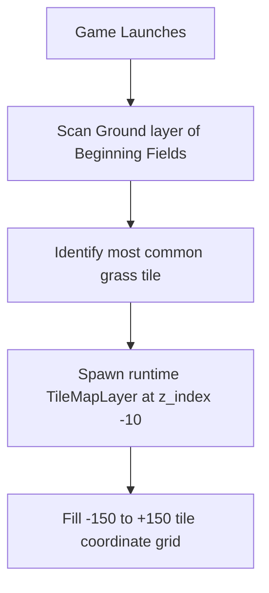

---

name: Seamless background grass overlay
overview: Dynamically fill the empty gray/black area surrounding the "Beginning Fields" tilemap with an automatically detected, repeating grass tile layer generated at runtime.
todos:

* id: spawner-script
content: "Create scripts/background_grass_spawner.gd: auto-detect dominant grass tile, spawn background TileMapLayer, and fill -150 to +150 grid"
status: completed
* id: scene-integration
content: "Modify scenes/game.tscn: instantiate BackgroundGrassSpawner Node2D, attach script, and assign tilemap_path to Beginning Fields"
status: completed
* id: functional-verification
content: "Verify visual coverage during camera movement and confirm collision boundaries remain fully intact"
status: completed
isProject: false

---

# Seamless background grass overlay

## Context

* **Engine:** Godot 4.x (leveraging the updated `TileMapLayer` architecture).
* **Current State:** The area outside the `Beginning Fields` tilemap in `[scenes/game.tscn](scenes/game.tscn)` currently renders as a blank gray/black void when the camera pans near the map edges.
* **Goal:** Provide a purely visual backdrop that makes the world feel sprawling and unbroken, without manually painting thousands of tedious tiles in the editor or breaking existing boundary lines.

## Functional Flow

1. **Initialization:** On startup, the spawner references the target map configured via the editor.
2. **Tile Detection:** It analyzes the existing `Ground` layer cells to dynamically match the aesthetic of the map by choosing the most heavily utilized tile.
3. **Background Generation:** It procedurally populates a massive background grid that spans well beyond the viewable camera bounds.

## Files to touch

| Area | Action |
| --- | --- |
| `[scripts/background_grass_spawner.gd](scripts/background_grass_spawner.gd)` | **Create** handles the automatic tile scanning, runtime `TileMapLayer` instantiation, and grid population. |
| `[scenes/game.tscn](scenes/game.tscn)` | **Modify** add the `BackgroundGrassSpawner` node as a child, attach the script, and wire up the `tilemap_path` export variable to point to `Beginning Fields`. |

## Technical notes

* **Layering & Sorting:** The generated background explicitly forces a `z_index = -10` to guarantee it renders beneath the player, NPCs, interactive environment items, and standard map decorations.
* **Grid Coverage:** A grid range of `-150` to `+150` in tile coordinates provides a massive, lightweight buffer zone that completely accommodates camera zoom and extreme player positioning.
* **Performance:** Scanning and generation occur exactly once on `_ready()`, meaning there is absolutely zero runtime ticking overhead or frame drops during gameplay.

## Out of scope (unless you ask)

* Modifying, recreating, or shifting existing collision borders, static body walls, or invisible blockers.
* Adjusting NPC navigation meshes (`NavigationRegion2D`) or pathfinding logic.
* Altering any gameplay boundaries—the outer grass is strictly a visual illusion and remains physically inaccessible to both players and AI.